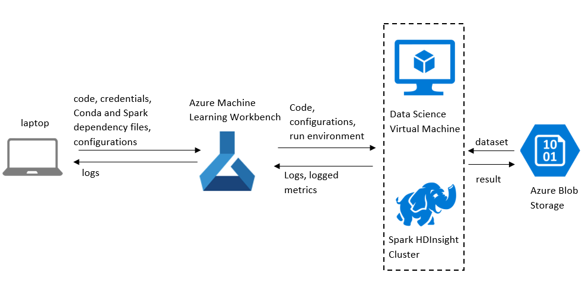

# Vienna on Terabytes Data

-[//]: # ""
 +## Link of the Gallery GitHub repository
 +
 +Following is the link to the public GitHub repository: 
 +
 +[https://github.com/Azure/MachineLearningSamples-BigData](https://github.com/Azure/MachineLearningSamples-BigData)

## Prerequisites
[//]: # (Please note this section will be included in the Readme file on GitHub repo.) 
The prerequisites to run this example are as follows:

1. An [Azure account](https://azure.microsoft.com/en-us/free/) (free trials are available).
2. An installed copy of [Azure Machine Learning Workbench](./overview-what-is-azure-ml.md) following the [quick start installation guide](./quick-start-installation.md) to install the program and create a workspace.
3. This scenario assumes that you are running Azure ML Workbench on Windows 10 with Docker engine locally installed. If you are using macOS, the instruction is largely the same.
4. A Data Science Virtual Machine (DSVM) for Linux (Ubuntu). (https://azuremarketplace.microsoft.com/en-us/marketplace/apps/microsoft-ads.linux-data-science-vm-ubuntu). You can provision a Ubuntu DSVM following the instructions [here](https://docs.microsoft.com/en-us/azure/machine-learning/machine-learning-data-science-provision-vm). We recommend using a virtual machine with at least 8 cores and 32-GB of memory. You need the DSVM IP address, user name and password to try out this example.
5. A HDInisght Spark Cluster with HDP version 3.6 and Spark version 2.1.1. Visit [Create an Apache Spark cluster in Azure HDInsight] (https://docs.microsoft.com/en-us/azure/hdinsight/hdinsight-apache-spark-jupyter-spark-sql) for details of how to create HDInsight clusters. We suggest using a three-worker cluster with each worker having 16 cores and 112-GB of memory. You need the cluster name, SSH user name and password to try out this example.
6. An Azure Storage account. You can find instructions for creating storage account [here](https://docs.microsoft.com/en-us/azure/storage/common/storage-create-storage-account). Also create two Blob containers with name "`fullmodel`" and "`onemonthmodel`" in this storage account. The storage account is used to save intermediate compute results and machine learning models. You need the storage account and access key to try out this example.

The Ubuntu DSVM and the HDInsight cluster created in the pre-requisite list are compute targets. Compute targets are the compute resource in the context of AML Workbench, which might be different from the computer where Azure ML Workbench runs. 

## Introduction

This example illustrates how data scientists can use Azure ML Workbench to develop solutions that requires use of big data. We show how a user by using Azure ML Workbench can follow a happy path of starting from a fraction of a large dataset, iterating through data preparation, feature engineering and machine learning, and then eventually extending the process to the entire large dataset. 

Along the way, we show the following key capabilities of Azure ML Workbench:
<ul>
    <li>Easy switching between compute targets:</li>We show how the user can set up different compute targets and use them in  experimentation. In this example, we use a Ubuntu DSVM and a HDInsight cluster as the compute targets. We also show the user how to configure the compute targets depending on the availability of resources. In particular, after scaling out the Spark cluster (that is, including more worker nodes in the Spark cluster), how the user can use the resources through Azure ML Workbench to speed up experiment runs.
    <li>Run History Tracking: </li> We show the user how Azure ML Workbench can be used as a way to track the performance of  machine learning models and other metrics of interests.
    <li>Operationalization of the Machine Learning Model: </li> we show the user how to use the build-in tools within Azure ML Workbench to deploy the trained machine learning model as web service on Azure Container Service (ACS), and how to use the web service to get mini-batch predictions through REST API Calls. 
    <li> Azure ML Workbench's capability to support Terabytes data.
</ul>

## Use Case Overview

[//]: # (Note this section is included in the Readme file on GitHub repo.) 

Forecasting the workload on servers or a group of servers is a common business need for technology companies that manage their own infrastructure. To reduce infrastructure cost, services running on under-utilized servers should be grouped together to run on a smaller number of machines, and services running on heavy-loaded servers should be given more machines to run. In this scenario, we focus on workload prediction for each machine (or server). In particular, we use the session data on each server to predict the workload class of the server in future. We classify the load of each server into low, medium, and high classes by using Random Forest Classifier in Apache Spark ML. The machine learning techniques and workflow in this example can be easily extended to other similar problems.   

## Data Description

The data used in the scenario is synthesized server workload data hosted in an Azure blob storage account that's publically accessible. The specific storage account info can be found in the `dataFile` field of [`Config\storageconfig.json`](https://github.com/Azure/MachineLearningSamples-BigData/blob/master/Config/fulldata_storageconfig.json). You can use the data directly from the Azure blob storage. In the event that the storage is used by many users simultaneously, you can opt to use [azcopy](https://docs.microsoft.com/en-us/azure/storage/common/storage-use-azcopy-linux) to download the data into your own storage. 

The total data size is around 1 TB. Each file is around 1-3 GB and is in CSV file format without header. Each row of data represents the load of a transaction on a particular server.  The detailed information of the data schema is as follows:

Column Number | Field Name| Type | Description |  
|------------|------|-------------|---------------|
1  | `SessionStart` | Datetime |	Session start time
2  |`SessionEnd`	| Datetime Session end time
3 |`ConcurrentConnectionCounts` | Integer |	Number of Concurrent Connections
4 | `MbytesTransferred`	| Double | Normalized data transferred in Megabytes
5 | `ServiceGrade` | Integer |	Service grade for the session
6 | `HTTP1` | Integer|	whether the session uses HTTP1 or HTTP2
7 |`ServerType` | Integer	|Server type
8 |`SubService_1_Load` | Double |	Subservice 1 load
9 | `SubService_1_Load` | Double | 	Subservice 2 load
10 | `SubService_1_Load` | Double | 	Subservice 3 load
11 |`SubService_1_Load`	| Double |  Subservice 4 load
12 | `SubService_1_Load`| Double |  	Subservice 5 load
13 |`SecureBytes_Load`	| Double | Secure bytes load
14 |`TotalLoad`	| Double | Total load on server
15 |`ClientIP` | String|	Client IP address
16 |`ServerIP` | String|	Server IP address


Note while the expected data types are listed in the preceding table, due to missing values and dirty-data problems, there is no guarantee that the data types is as expected and processing of the data should take this into consideration. 


## Scenario  Structure

The files in this example are organized as follows.

| File Name | Type | Description |
|-----------|------|-------------|
| `Code` | Folder | The  folder contains all the code in the example |
| `Config` | Folder | The  folder contains the customized configuration |
| `Image` | Folder | The folder  used to save images for the README file |
| `Model` | Folder | The folder used to save model files downloaded from Azure Blob storage |
| `Code/etl.py` | Python file | the Python file used for data preparation and feature engineering |
| `Code/train.py` | Python file | The Python file used to train a three-class multi-classfication model  |
| `Code/webservice.py` | Python file | The Python file used for operationalization  |
| `Code/scoring_webservice.py` | Python file |  The Python file used for data transformation and calling the web service |
| `Code/O16Npreprocessing.py` | Python file | The Python file used to preprocess the data for scoring_webservice.py.  |
| `Config/storageconfig.json` | JSON file | The configuration file for the Azure blob container that stores the intermediate results and model for processing and training on one-month data |
| `Config/fulldata_storageconfig.json` | Json file |  The configuration file for the Azure blob container that stores the intermediate results and model for processing and training on full dataset|
| `Config/webservice.json` | JSON file | The configuration file for scoring_webservice.py|
| `Config/conda_dependencies.yml` | YAML file | The Conda dependency file |
| `Config/dsvm_spark_dependencies.yml` | YAML file | the Spark dependency file for Ubuntu DSVM |
| `Config/hdi_spark_dependencies.yml` | YAML file | the Spark dependency file for HDInsight Spark cluster |
| `readme.md` | Markdown file | The README markdown file |


You can create an Azure ML Workbench project with a pre-created git repository. In the project directory, clone the Git repository at https://github.com/Azure/MachineLearningSamples-BigData to download the files. Run git status to inspect the status of the files for version tracking. 

### Data Ingestion & Flow

The code in [`Code/etl.py`](https://github.com/Azure/MachineLearningSamples-BigData/blob/master/Code/etl.py)  loads data from the publicly accessible container (`dataFile` field of [`Config\storageconfig.json`](https://github.com/Azure/MachineLearningSamples-BigData/blob/master/Config/fulldata_storageconfig.json)). It includes data preparation and feature engineering, and saves the intermediate compute results and models to your own private container. The code in [`Code\train.py`](https://github.com/Azure/MachineLearningSamples-BigData/blob/master/Code/train.py) loads the intermediate compute result from the private container, trains the multi-class classification model, and finally writes the trained machine learning model to the private container. It is recommended that the user use one container for experimentation on the one-month dataset and then another one for experimentation on the full dataset. Since the data and model are saved as Parquet file, each file is actually a folder in the container, containing multiple blobs. The resulting container look as follows:

| Blob Prefix Name | Type | Description |
|-----------|------|-------------|
| featureScaleModel | Parquet | Standard scaler model for numeric features |
| stringIndexModel | Parquet | String indexer model for non-numeric features|
| oneHotEncoderModel|Parquet | One-hot encoder model for categorical features |
| mlModel | Parquet | trained machine learning model |
| info| CSV | information about the transformed data, including training start, training end, duration, the timestamp for train-test splitting and columns for indexing and one-hot encoding.

The files/blobs in the preceding table are used for operationalization.

### Data Preparation & Feature Engineering


### Architecture Diagram


The following diagram shows end-to-end workflow:


### Experimentation

In the following, we show the user how to use remote compute target functionality in AML workbench. We first load small amount of data and run the [`Code/etl.py`](https://github.com/Azure/MachineLearningSamples-BigData/blob/master/Code/etl.py) on a Ubuntu DSVM for fast iteration. We can further limit the work we do in  [`Code/etl.py`](https://github.com/Azure/MachineLearningSamples-BigData/blob/master/Code/etl.py) by passing an extra argument for faster iteration. In the end, we use a HDInsight cluster to train with full data.     

The  [`Code/etl.py`](https://github.com/Azure/MachineLearningSamples-BigData/blob/master/Code/etl.py) file contains the code for loading the data, data preparation and feature engineering. We have included two arguments: (1) a configuration file for Azure Blob storage container for storing the intermediate compute results and models, (2) debug config for faster iteration.

The first argument is a local configuration file where you store the Azure Blob storage information and specify where to load the data. By default, it is  [`Code/storageconfig.json`](https://github.com/Azure/MachineLearningSamples-BigData/blob/master/Code/storageconfig.json) and it is going to be used in the one-month-data run. And we also include [`Code/fulldata_storageconfig.json`](https://github.com/Azure/MachineLearningSamples-BigData/blob/master/Code/fulldatastorageconfig.json) in the `Code` folder, which you need to use on the full-dataset run. Modify the JSON files to configure the storage account, storage key, and the blob container to store the intermediate results. By default, the blob container for one-month-data run is "`onemonthmodel`" and the blob container for full-dataset run is "`fullmodel`." Make sure you create these two containers in your storage account. Last but not the least, the `"dataFile"` in [`Code/fulldata_storageconfig.json`](https://github.com/Azure/MachineLearningSamples-BigData/blob/master/Code/fulldatastorageconfig.json) configures what data is loaded in [`Code/etl.py`](https://github.com/Azure/MachineLearningSamples-BigData/blob/master/Code/etl.py) and `"duration"` configures the range the data includes. If the duration is set to 'ONE_MONTH', the data loaded should be just one csv file among the seven files of the data for June-2016. If the duration is 'FULL', the full dataset, which is 1 TB, is loaded. You don't need to change `"dataFile"` and `"duration"` in these two configuration files.

The second argument is DEBUG. Setting it to 'FILTER_IP' enables a faster iteration. Use of this parameter is helpful when you want to debug your script.

#### Run the Experiment on the Docker of Ubuntu DSVM

#####  Setting up the compute target for Docker on Ubuntu DSVM

Start the commandline from Azure ML Workbench, then run 

```az ml computetarget attach --name dockerdsvm --address $DSVM_IP  --username $user --password $password --type remotedocker```

Once the commandline is successfully finished executing you will see the following two files created in aml_config folder:
dockerdsvm.compute: contains the connection and configuration information for a remote execution target
dockerdsvm.runconfig: set of run options used when executing within the Azure ML Workbench application

Navigate to dockerdsvm.runconfig and change the configuration of the following fields as shown below:

    PrepareEnvironment: true 
    CondaDependenciesFile: Config/conda_dependencies2.yml 
    SparkDependenciesFile: Config/dsvm_spark_dependencies.yml

By setting "PrepareEnvironment" to true, you allow Azure ML Workbench to create the runtime environment whenever you submit a job. `Config/conda_dependencies.yml` and `Config/dsvm_spark_dependencies.yml` contains the customization of the runtime environment. You can always modify the Conda dependencies, Spark configuration and Spark dependencies by editing these two YMAL files. For this example, we added `azure-storage` and `azure-ml-api-sdk` as extra python packages that are need for experimentation.

#####  Run `etl.py` on DSVM Docker with debug parameter FILTER_IP

```az ml experiment submit -t dockerdsvm -c dockerdsvm ./Code/etl.py ONE_MONTH FILTER_IP ./Config/storageconfig.json```

avigate to the side panel, click "Run" to see the run history of  `etl.py`. Notice that the run time is around two minutes. With this argument, you will notice a faster iteration if you plan to change your code to include new features. You might need to run this step multiple times when dealing with your own machine learning problems to explore the dataset or create new features. With the customized restriction on what data to load and further filtering of what data to process, you can quicken your experimentation process. As you experiment, you should periodically save the changes in your code to the git repository.  


##### Run `etl.py` on DSVM Docker without debug parameter FILTER_IP

```az ml experiment submit -t dockerdsvm -c dockerdsvm ./Code/etl.py ONE_MONTH FALSE ./Code/storageconfig.json```

Navigate to the side panel, click "Run" to see the run history of  `etl.py`. Notice that the run time is around four minutes. The processed result of this step is saved into the container and will be loaded for training in train.py. In addition, the string indexders, encoder pipelines, and the standard scalers are also saved to the private container and will be used in operationalization (O16N). 


##### Run `train.py` on DSVM Docker

```az ml experiment submit -t dockerdsvm -c dockerdsvm ./Code/train.py ./Config/storageconfig.json```

This step loads the intermediate compute results from the run of `etl.py` and  trains a machine learning model.

Once you have successfully finished the experimentation on the small data, you can then continue to run the experimentation on the full dataset. You can start off by using the same code and then experiment with argument and compute target changes.  

####  Run the Experiment on the Docker of HDInsight Cluster

##### Create compute target in Azure ML workbench for the HDInsight cluster

```az ml computetarget attach --name myhdi --address $clustername-ssh.azurehdinsight.net --username sshuser --password $Ppassword --type cluster```

Once the commandline is successfully finished, you will see the following two files created in aml_config folder:
myhid.compute: contains connection and configuration information for a remote execution target
myhdi.runconfig: set of run options used when executing within the Azure ML Workbench application

Navigate to myhdi.runconfig and change the configuration as follows:  
```PrepareEnvironment: true```


##### Run `etl.py` with fulldata on HDInsight cluster

```az ml experiment submit -a -t myhdi -c myhdi -d Config/conda_dependencies.yml -s  Config/hdi_spark_dependencies.yml ./Code/etl.py FULL FALSE Config/fulldata_storageconfig.json```

Since this job lasts for a relatively long time （around two hours） we can use "-a" to disable output streaming. Once the job is done, in the "Run History", you can look into the driver log and also the controller log. If you have a larger cluster, you can always reconfig the configuraions in Config/hdi_spark_dependencies.yml to use more instances or more cores. You can also see the output of this step in the "fullmodel" container in your storage account. 


##### Run `train.py` on HDInsight cluster

```az ml experiment submit -a -t myhdi -c myhdi -d Config/conda_dependencies.yml -s  Config/hdi_spark_dependencies.yml ./Code/train.py Config/fulldata_storageconfig.json```

Since this job lasts for a relatively long time（around half hour), we use "-a" to disable output streaming.

#### Run History Exploration

Run history is a feature that enables tracking of your experimentation in Azure ML Workbench. By default, it tracks the duration of the experimentation. In our specific example, when we move to the full dataset for "`Code/etl.py`" in the experimentation, we notice that duration significantly increases. You can also log specific metrics for tracking purposes. To enable metric tracking, add in the following lines of code to the head of your python file:
```python
# import logger
from azureml.logging import get_azureml_logger

# initialize logger
run_logger = get_azureml_logger()
```
For further information, search for "run_logger" to read the entire documentation. Navigate to "Runs" on the righthand sidebar of Azure ML Workbench to see the run history for each python file. 


### Operationalization

In this section, we operationalize the model we created in the previous steps as a web service and demo how we can use the web service to fulfill our prediction requirements. Choose a unique string as the environment for operationalization.

1. Create the environment for operationalization and create the  resource group:

```az ml env setup -c -n [unique] --location eastus2 --cluster -z 5 -l eastus2 --yes ```

```az ml env set -g [unique]rg -n $unique ```
Please note here we choose to use Azure Container Service as the environment

2. Create the model management account and use the model management account:

```az ml account modelmanagement create --location  eastus2 -n [unique]acc -g [unique]rg --sku-instances 4 --sku-name S3 ```


```az ml account modelmanagement set  -n [unique]acc -g [unique]rg ```

3. Download and register the models

Download the models  in the "fullmodel" container to your local machine in the directory of code. Do not download the parquet data file with name "vmlSource.parquet" as it is not a model file but an intermediate compute result. You can also reuse the model files we have included in the git. Register the models as follows:

```az ml model register -m vmlModel -n vmlModel -t fullmodel ```

```az ml model register -m  vfeatureScaleModel -n fullmodelvfeatureScaleModel -t fullmodel```

```az ml model register -m  voneHotEncoderModel -n  voneHotEncoderModel -t fullmodel```

```az ml model register -m  vstringIndexModel -n vstringIndexModel -t fullmodel```

```az ml model register -m  info.pickle -n info.pickle -t fullmodel```

The output of each command gives a model ID and is needed in the next step.

4. Create manifest for the web service

```az ml manifest create -n $webserviceName -f webservice.py -r spark-py -c conda_dependencies.yml -i $modelID1 -i $modelID2 -i $modelID3 -i $modelID4```

The output gives a manifest ID for the next step. 

You can test webservice.py by running 

```az ml experiment submit -t dockerdsvm -c dockerdsvm ./Code/webservice.py ./Code/fulldata_storageconfig.json ```

5. Create a Docker image 

```az ml image create -n [unique]image --manifest-id $manifestID```

The output gives an image ID for the next step as this docker image is used in ACS. 

6. Deploy the web service to the ACS cluster

```az ml service create realtime -n [unique] --image-id $imageID --cpu 0.5 --memory 2G ```
The output gives a service ID, and you need to use it to get the authorization key and service URL.

7. Call the webservice in Python code to score in mini-batches.


You can test the web service for mini-batch scoring by using
```az ml experiment submit -t dockerdsvm -c dockerdsvm ./Code/scoring_webservice.py ./Config/webservice.json```

To use this, you need to put in the relevant content in `./Config/webservice.json`.
Use 

``` az ml service keys realtime -i $ServiceID ``` 

to get the authorization key and use

` az ml service usage realtime -i $ServiceID`

to get the service URL.

 

## Conclusion

This example highlights how to use Azure ML Workbench to train a machine learning model on big data and operationalize the trained model. In particular, we showed how to:

* Use and configure different compute targets.

* Run history for tracking metrics and different runs.

* Operationalization.

Users can extend the code to explore cross-validation  and hyper-parameter tuning. To learn more about hyper-parameter tuning, please visit https://github.com/Azure/MachineLearningSamples-DistributedHyperParameterTuning.  
To learn more about time-series forcasting with cross-validation, please visit https://github.com/Azure/MachineLearningSamples-EnergyDemandTimeSeriesForecasting.


## Contact

Feel free to contact Daisy Deng (daden@microsoft.com) with any question or comment.


